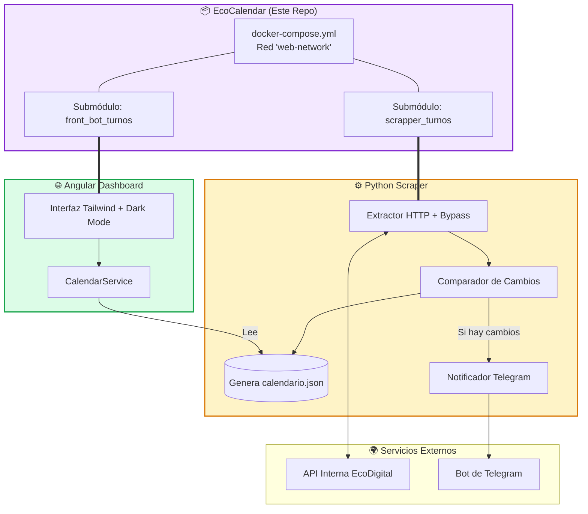

# 🗓️ EcoCalendar - Ecosistema de Monitoreo de Turnos

> **📌 Nota del Ecosistema:** Este repositorio actúa como el **orquestador principal** del proyecto. Utiliza **Git Submodules** para gestionar de forma independiente el Backend (Scraper API) y el Frontend (Dashboard Visual), permitiendo un despliegue unificado mediante Docker Compose.
> 
> 🔗 **Backend (Scraper API):** [scrapper_turnos](https://github.com/MartinCiro/scrapper_turnos)  
> 🔗 **Frontend (Dashboard):** [front_bot_turnos](https://github.com/MartinCiro/front_bot_turnos/tree/stable)

Un sistema integral diseñado para monitorear, extraer, procesar y visualizar calendarios laborales de la plataforma **EcoDigital**. Detecta cambios en turnos, breaks y días libres en tiempo real, notificando vía Telegram y presentando los datos en un dashboard moderno y responsivo.

---

## 🚀 Características del Ecosistema

### ⚙️ Backend (`scrapper_turnos`)
- **API HTTP Directa:** Sin dependencias de Playwright/Selenium. Consume directamente los endpoints JSON internos de EcoDigital, garantizando velocidad y bajo consumo de recursos.
- **Bypass de Cloudflare:** Implementación de headers con fingerprinting específico para evadir bloqueos WAF.
- **Motor de Detección de Cambios:** Compara el estado actual con backups históricos, identificando exactamente qué cambió (horario, tipo de turno, break o día libre).
- **Multi-Tenant:** Soporta el monitoreo simultáneo de múltiples usuarios con sesiones y cookies independientes.
- **Notificaciones Inteligentes:** Alertas vía Telegram solo cuando se detectan modificaciones reales.

### 🖥️ Frontend (`front_bot_turnos`)
- **UI Moderna:** Construida con **Angular** y **Tailwind CSS**, con soporte nativo para Modo Oscuro.
- **Detección Visual:** Resalta automáticamente en color rojo/rose los días con modificaciones y muestra el historial "Antes ➡️ Después".
- **Resúmenes en Tiempo Real:** Cálculo automático de horas semanales, días libres y cambios pendientes.
- **Desacoplado:** Consume los archivos JSON estructurados por el backend, permitiendo despliegues estáticos o vía API.

---

## 🏗️ Arquitectura del Sistema

El proyecto utiliza un patrón de **Orquestación por Submódulos**, donde este repositorio define la infraestructura (Docker) que conecta ambos mundos.



---

## 📂 Estructura del Repositorio

```text
eco_calendar/
├── .gitmodules                 # 🔗 Definición de los submódulos de Git
├── docker-compose.yml          # 🐳 Configuración de Producción (Nginx + Python)
├── docker-compose.dev.yml      # 🛠️ Configuración de Desarrollo (Hot-reload Angular + Python)
├── .env.example                # 📋 Plantilla de variables de entorno
├── front_bot_turnos/           # 📁 Submódulo: Frontend (Angular + Tailwind)
└── scrapper_turnos/            # 📁 Submódulo: Backend (Python + Requests)
```

---

## 💡 ¿Por qué usar Git Submodules en lugar de un Monorepo tradicional?

1. **Ciclos de Vida Independientes:** El backend puede actualizarse, probarse y desplegarse sin obligar a recompilar el frontend, y viceversa.
2. **Separación de Responsabilidades:** Mantiene los historiales de Git limpios y específicos para cada stack tecnológico (Python vs. TypeScript).
3. **Reutilización:** El backend `scrapper_turnos` podría ser consumido en el futuro por una aplicación móvil o un bot de Discord sin arrastrar el código de Angular.
4. **Orquestación Sencilla:** Docker Compose actúa como el "pegamento" que une ambos servicios en una red local (`web-network`), simulando un entorno de producción real.

---

## 🛠️ Instalación y Despliegue

### 1. Clonar el Repositorio (¡Importante!)
Debido al uso de submódulos, debes clonar el repositorio con el flag `--recurse-submodules` para descargar el contenido de las carpetas `front_bot_turnos` y `scrapper_turnos`:

```bash
git clone --recurse-submodules https://github.com/MartinCiro/eco_calendar.git
cd eco_calendar
```
*(Si ya lo clonaste sin el flag, ejecuta: `git submodule update --init --recursive`)*

### 2. Configurar Variables de Entorno
Copia el archivo de ejemplo y completa tus credenciales:

```bash
cp .env.example .env
```

Edita el archivo `.env`:
```env
# 👥 Credenciales de EcoDigital (separadas por coma para múltiples usuarios)
USERS_ECO=usuario1@empresa.com,usuario2@empresa.com
PASSWDS_ECO=contrasena1,contrasena2

# 🤖 Telegram (para notificaciones de cambios)
TELEGRAM_TOKEN=123456:ABC-DEF1234ghIkl-zyx57W2v1u123ew11
TELEGRAM_CHAT=123456789

# ⚙️ Configuración del Bot
HEADLESS=True
DISPLAY=:0
PYTHONUNBUFFERED=1
```

### 3. Ejecutar el Ecosistema

#### Opción A: Entorno de Producción
Construye y levanta los contenedores optimizados (Angular compilado + Nginx, Python en modo normal):
```bash
docker compose up -d --build
```
- **Frontend:** Disponible en `http://localhost`
- **Backend:** Ejecutándose en segundo plano, generando JSONs y enviando alertas.

#### Opción B: Entorno de Desarrollo (Recomendado para contribuir)
Levanta los contenedores con **hot-reload** para que los cambios en el código de Angular o Python se reflejen al instante:
```bash
docker compose -f docker-compose.dev.yml up --build
```
- **Frontend (Dev):** Disponible en `http://localhost:4300` (con recarga automática).
- **Backend (Dev):** Logs en tiempo real en la terminal.

---

## 🔄 Flujo de Trabajo con Submódulos (Para Desarrolladores)

Si realizas cambios dentro de uno de los submódulos (ej. `scrapper_turnos`), el proceso de commit es de dos pasos:

```bash
# 1. Entra al submódulo, haz tus cambios y súbelos
cd scrapper_turnos
git add .
git commit -m "feat: mejorar detección de cambios en breaks"
git push origin main

# 2. Vuelve al repositorio principal y actualiza el "puntero" del submódulo
cd ..
git add scrapper_turnos
git commit -m "chore: actualizar puntero de scrapper_turnos a la última versión"
git push origin main
```
> Para sincronizar tu repositorio local con las últimas actualizaciones de todos los submódulos, usa siempre:  
> `git pull --recurse-submodules`

---

## ⚠️ Consideraciones de Uso Responsable

- Esta herramienta está diseñada para el **monitoreo personal** de los propios turnos laborales.
- El uso de técnicas de bypass de WAF (Cloudflare) debe hacerse con moderación. El bot incluye retardos aleatorios para no saturar los servidores de EcoDigital.
- El autor no se hace responsable del uso indebido de esta herramienta para scraping masivo no autorizado.

---

## 🤝 Créditos

- **Plantilla base de arquitectura:** [Luis Villalba](https://github.com/villalbaluis/arquitectura-bots-python)
- **Librerías clave:** `requests`, `python-dotenv`, `python-telegram-bot`, `Angular`, `Tailwind CSS`.

---

## 👤 Autor

**Martin Ciro**  
[](https://github.com/MartinCiro)

---
*Desarrollado con Python, Angular y Docker. Una solución Full-Stack para la automatización y visualización de datos laborales.*